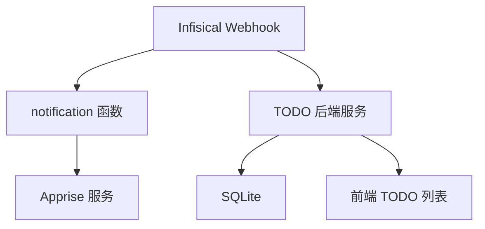
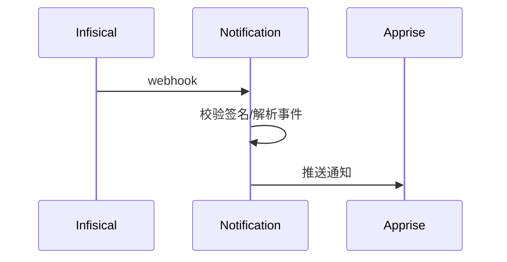

# 架构设计

## 总体架构

## 技术栈
- **后端:** Go 1.23 / Gin + GORM
- **前端:** TBD
- **数据:** SQLite

## 核心流程

## 重大架构决策
完整的ADR存储在各变更的how.md中，本章节提供索引。

| adr_id | title | date | status | affected_modules | details |
|--------|-------|------|--------|------------------|---------|
| ADR-001 | 引入 Gin + SQLite 作为 TODO 后端 | 2026-01-20 | ✅已采纳 | backend | helloagents/history/2026-01/202601202042_todo-backend/how.md |

